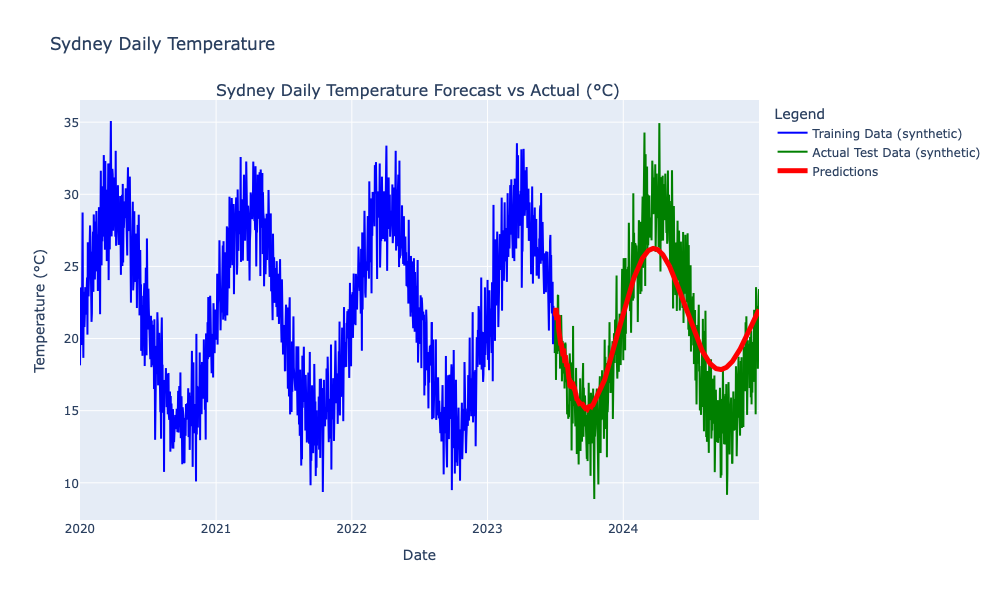

# `power-pole`

## Overview

This simple example code demonstrates a complete workflow for time series forecasting using `skforecast` (together with `sklearn`) on synthetic temperature data for Sydney, Australia. 

Here's a brief overview of what the code does:

1. Generates synthetic daily temperature data for Sydney over a specified time range.
2. Splits the data into training and testing sets.
3. Trains an auto-regressive forecasting model on the training data (see below for details).
4. The model then generates predictions for the test period.
5. The test data is used to assess how well these predictions match the actual values and it evaluates the model's performance using the Root Mean Squared Error (RMSE) metric.
6. Visualises the results using an interactive Plotly graph, showing the training data, actual test data, and predictions.

The code is structured as an object-oriented Python class, with methods for each step of the process. It uses external configuration from a TOML file for flexibility, incorporates logging for tracking the execution, and employs type hints for better code readability and maintainability. This structure makes it easy to modify parameters, reuse the code for different datasets, and potentially extend the functionality for more complex forecasting tasks. e.g. choice of different models, hyperparameter tuning, etc.

## Sample Output

## Model

The model used here is an auto-regressive linear regression model for time series forecasting.

1. **Auto-regressive**: The model uses past values of the time series to predict future values. The 'lags' parameter determines how many past time steps are considered for each prediction.

2. **Linear regression**: The underlying model is a simple linear regression, which assumes a linear relationship between the input features (lagged values) and the output (future value).

3. **Time series specific**: This model is designed for time series data, taking into account the temporal nature and potential seasonality of the data.

4. **Univariate**: The model is using only the temperature variable itself for prediction, not incorporating any external variables.

5. **Stationary assumption**: Linear regression models typically assume stationarity in the time series, meaning consistent statistical properties over time.

Mathematically, the model can be represented as:

$y(t) = \beta_0 + \beta_1 y(t-1) + \beta_2 y(t-2) + ... + \beta_k y(t-k) + \epsilon$

Where:

- $y(t)$ is the prediction for time t
- $k$ is the number of lags
- $\beta_i$ are the coefficients "learned" by the linear regression
- $\epsilon$ is the error term.

This model is relatively simple and interpretable, suitable for linear trends in time series data, but may not capture complex non-linear patterns or long-term dependencies.