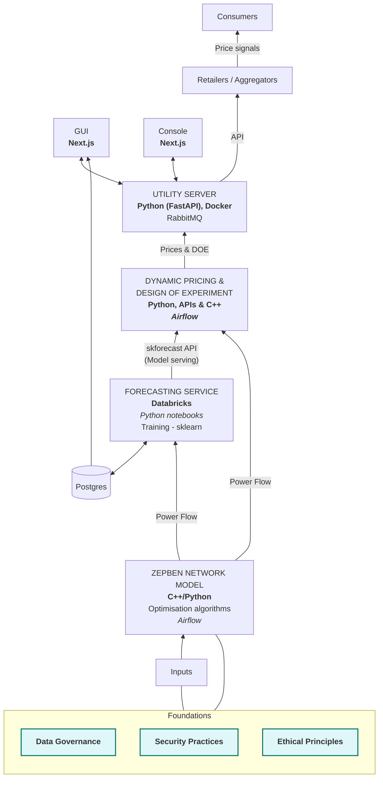

```mermaid
graph BT
    %% Foundations Layer
    subgraph Foundations
        G1[Data Governance]:::foundation
        G2[Security Practices]:::foundation
        G3[Ethical Principles]:::foundation
    end


    %% External APIs and Clients
    M[Consumers]

    L[Retailers / Aggregators] -->|"Price signals"| M
    G --->|"API"| L

    %% Analytics Layer
    J[GUI<br><b>Next.js</b>]
    K[Console<br><b>Next.js</b>] 

    %% Storage Layer
    G <--> J
    G["UTILITY SERVER<br><b>Python (FastAPI), Docker</b><br>RabbitMQ"] <--> K

    %% Processing Layer
    E[DYNAMIC PRICING &<br>DESIGN OF EXPERIMENT<br><b>Python, APIs & C++<b><br><i>Airflow</i>] -->|"Prices & DOE"| G

    %% Ingestion Layer
    B[(Postgres)] --> J
    C[FORECASTING SERVICE<br><b>Databricks</b><br><i>Python notebooks</i><br>Training - sklearn] -->|"skforecast API<br>(Model serving)"| E
    B <--> C

    %% Data Sources

    A ----->|"Power Flow"| E
    A -->|"Power Flow"| C

    D["Inputs"] --> A

    A["ZEPBEN NETWORK MODEL<br><b>C++/Python</b><br>Optimisation algorithms<br><i>Airflow</i>"]
    Foundations --- A
    Foundations --- D

classDef foundation fill:#e0f7fa,stroke:#00796b,stroke-width:2px,font-weight:bold
```